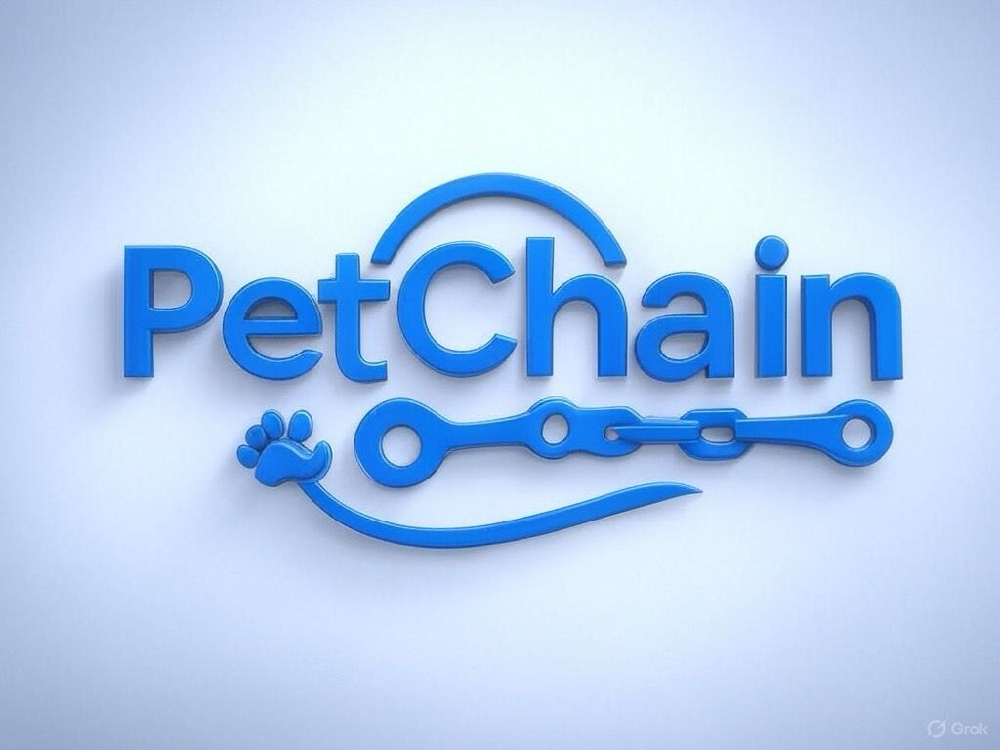

  
 

 
 <h1 align="center">PetChain- Smart Health Tracking For Your Pet</h1>
 
 

   
   
   
 

 
 

   
 

## 👀 Overview
PetChain is a decentralized platform on StarkNet that securely manages pet medical records.
Today, health data is often scattered, lost, or stuck in outdated systems—making it hard to track vaccinations, manage treatments, or respond quickly in emergencies.

By making records tamper-proof and universally accessible, PetChain keeps vets and pet owners aligned—no matter where the pet is or who’s treating them.
Pets get a scannable tag for quick access to key medical details. This tag can act as a tracker if pet goes missing.

## ⚡ Features
**1. Scannable Pet Tags:** Each pet gets a unique QR code and tag linked to its medical history—instantly scannable by vets or emergency responders. The tag displays key info and a customizable message from the owner, doubling as a tracker if the pet goes missing.

**2. Always-Available Records:** Medical history is stored on StarkNet, ensuring records are tamper-proof, permanent, and accessible anytime.

**3. Controlled Access:** Pet owners control who sees what, share vaccination status publicly or give full access to a vet when needed.

**4. Smart Notifications:** Get automatic alerts for upcoming vaccinations and routine check-ups, so you never miss a date.

**5. Vet-Ready Integration:** Designed to plug into existing vet or hospital software with minimal friction.

**6. Offline Mode** – View essential info even without internet.

**7. Privacy:** Uses advanced cryptography (like ZKPs) to keep sensitive data secure, even on-chain.

## 🛠 Tech Stack
* **Frontend:** 
  - Framework: Next.js (React + TypeScript)
  - Styling: Tailwind CSS
  - Hosting: Vercel
* **Backend:** NestJS, AWS, Heroku
* **Database:** PostgreSQL, TypeORM
* **BlockChain:** Cairo, StarkNetJs

## 🚀 Getting Started
This repository serves as the main repo, specifically tailored for **FRONTEND** contributions to the PetChain project.

To get this project up and running locally, ensure the following are installed on your system:

- Node.js (v16 or higher)
- npm or yarn
- Git
- Docker (optional, for DB or backend setup)

## 🤝 Contributing 
To contribute effectively, make sure to read through our [**Contribution Guide**](./contributing.md), which outlines 
* ✅ Code of Conduct
* 🧭 Step-by-step contribution process 
* 📋 Open tasks and other ways to get involved

## 🔗 Related Repositories
To work on other parts of the project, you can find the related repositories below:
* Backend – [GitHub Link](https://github.com/DogStark/petchain_api)
* Smart Contracts – [GitHub Link](https://github.com/DogStark/PetMedTracka-Contracts)
* Mobile App – [GitHub Link](https://github.com/DogStark/PetMedTracka-MobileApp)

## 📬 Contact & Support
For feedback, questions or collaboration:

* Contact project lead: [@llins_x](https://t.me/llins_x)
* Join Community Chat: [@PetChain Telegram Group](https://t.me/+fLbWYLN8jZw3ZTNk) 
*  Report Issues: Submit bug reports or feature requests via [GitHub Issues](https://github.com/DogStark/PetMedTracka-Contracts/issues).

⭐️ Star our [GitHub Repository](https://github.com/DogStark/pet-medical-tracka) to stay updated on new features and releases.

## 📜 Licence
PetChain is licensed under the MIT License.
