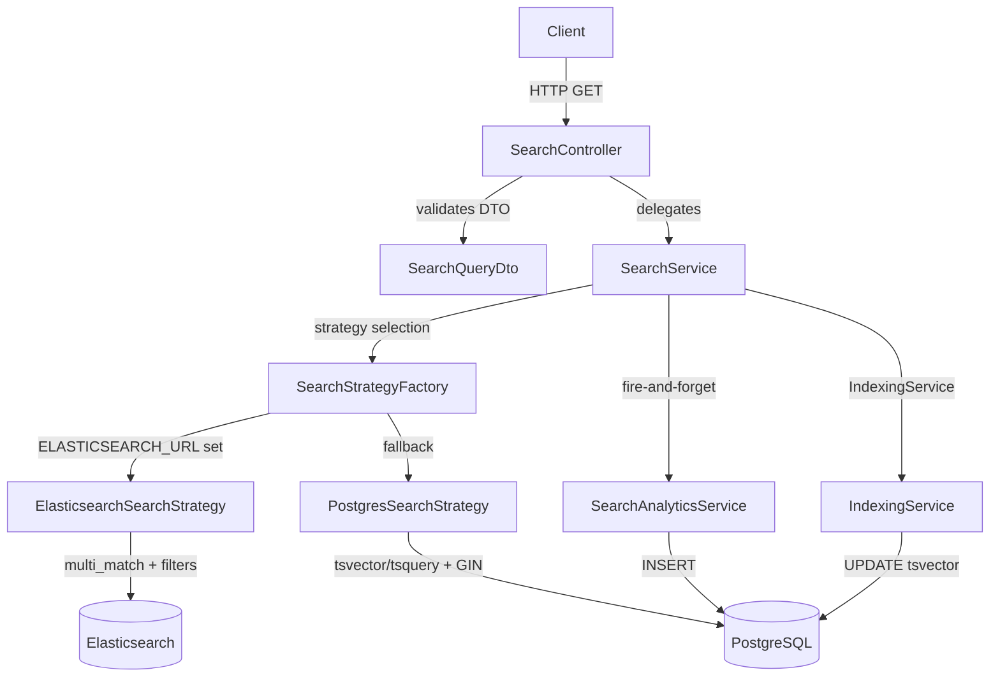
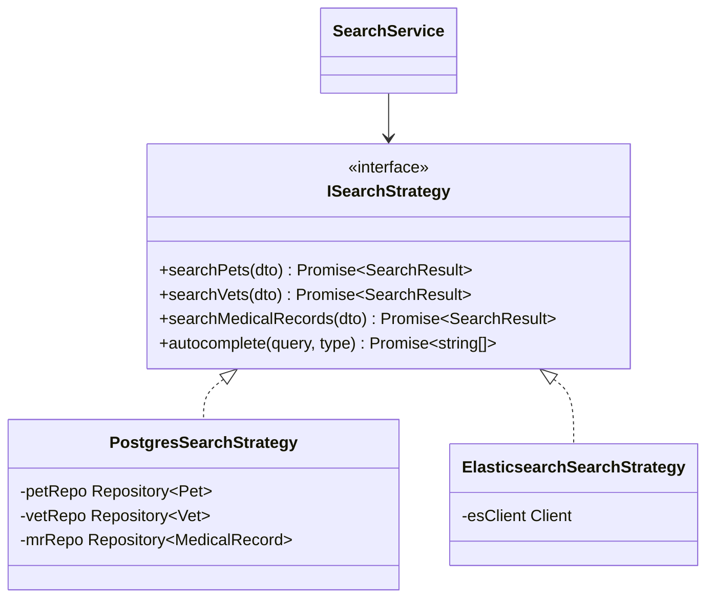
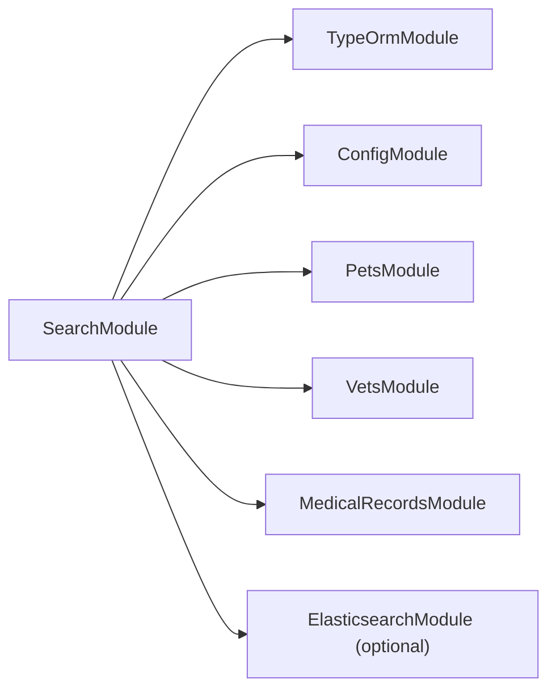

# Design Document: Search & Filtering Engine

## Overview

This document describes the technical design for upgrading the existing `SearchModule` in the PetChain NestJS backend from basic `ILIKE` queries to a production-grade search and filtering engine. The upgrade introduces PostgreSQL full-text search via `tsvector`/`tsquery` with GIN indexes as the primary search strategy, with optional Elasticsearch integration as an alternative when `ELASTICSEARCH_URL` is configured. The design covers advanced filtering, relevance scoring, geospatial vet search, global search, autocomplete, and search analytics tracking.

The existing module structure (`SearchController`, `SearchService`, `SearchAnalytics` entity, `SearchQueryDto`, and `SearchResult` interface) is preserved and extended rather than replaced, minimizing disruption to dependent modules.

---

## Architecture

### High-Level Architecture



### Strategy Pattern for Search Backend

The service uses a strategy interface `ISearchStrategy` so the active backend (Postgres or Elasticsearch) is swapped at startup based on environment configuration. This satisfies Requirement 11.5 without scattering `if (esConfigured)` checks throughout the service.



### Module Dependency Graph



---

## Components and Interfaces

### SearchController

Extends the existing controller with two new endpoints and input validation guards.

| Method | Route | Description |
|--------|-------|-------------|
| GET | `/search/pets` | Full-text pet search with filters |
| GET | `/search/vets` | Full-text vet search with geo support |
| GET | `/search/medical-records` | Full-text medical record search |
| GET | `/search/global` | Concurrent search across all entities |
| GET | `/search/autocomplete` | Partial-match suggestions |
| GET | `/search/popular` | Top 10 popular queries |
| GET | `/search/analytics` | Aggregated analytics |
| POST | `/search/reindex` | Trigger full reindex |

All endpoints use `ValidationPipe` with `transform: true` to coerce query string types and enforce DTO constraints.

### SearchQueryDto (extended)

The existing DTO is extended with missing fields required by the new requirements:

```typescript
export class SearchQueryDto {
  @IsOptional() @IsString() @MaxLength(500)
  query?: string;

  // Pagination
  @IsOptional() @Type(() => Number) @IsInt() @Min(1)
  page?: number = 1;

  @IsOptional() @Type(() => Number) @IsInt() @Min(1) @Max(100)
  limit?: number = 10;

  // Pet filters
  @IsOptional() @IsString() breed?: string;
  @IsOptional() @Type(() => Number) @IsInt() @Min(0) minAge?: number;
  @IsOptional() @Type(() => Number) @IsInt() @Min(0) maxAge?: number;
  @IsOptional() @IsEnum(PetSpecies) species?: PetSpecies;
  @IsOptional() @IsEnum(PetGender) gender?: PetGender;

  // Vet filters
  @IsOptional() @IsString() specialty?: string;
  @IsOptional() @IsString() location?: string;

  // Medical record filters
  @IsOptional() @IsString() condition?: string;
  @IsOptional() @IsString() treatment?: string;
  @IsOptional() @IsEnum(RecordType) recordType?: RecordType;
  @IsOptional() @IsDateString() dateFrom?: string;
  @IsOptional() @IsDateString() dateTo?: string;

  // Geospatial
  @IsOptional() @Type(() => Number) @IsNumber() @Min(-90) @Max(90)
  latitude?: number;
  @IsOptional() @Type(() => Number) @IsNumber() @Min(-180) @Max(180)
  longitude?: number;
  @IsOptional() @Type(() => Number) @IsNumber() @Min(0.1)
  radius?: number;

  // Sorting
  @IsOptional() @IsIn(['relevance','name','createdAt','visitDate','distance'])
  sortBy?: string;
  @IsOptional() @IsIn(['ASC','DESC'])
  sortOrder?: 'ASC' | 'DESC';

  // Misc
  @IsOptional() @IsBoolean() @Transform(({ value }) => value === 'true' || value === true)
  includeInactive?: boolean;
}
```

### SearchResult Interface (extended)

```typescript
export interface SearchResult<T = any> {
  results: (T & { relevanceScore?: number; distance?: number })[];
  total: number;
  page: number;
  limit: number;
  totalPages: number;
  searchTime: number;
  facets?: Record<string, FacetCount[]>;
  filters?: Record<string, any>;
}

export interface FacetCount {
  value: string;
  count: number;
}
```

### SearchService

The `SearchService` orchestrates the search flow:

1. Validate and sanitize the query string (strip SQL special characters via `xss` + regex).
2. Delegate to the active `ISearchStrategy`.
3. Append facet counts via a separate aggregation query.
4. Fire-and-forget analytics tracking via `SearchAnalyticsService`.
5. Return the `SearchResult`.

### SearchAnalyticsService

Extracted from the existing `trackSearch` private method into a dedicated injectable service. This allows independent testing and avoids coupling analytics persistence to the search hot path.

```typescript
interface ISearchAnalyticsService {
  track(event: SearchEvent): Promise<void>;
  getAnalytics(days: number): Promise<AnalyticsSummary>;
  getPopularQueries(limit: number): Promise<PopularQuery[]>;
}
```

### IndexingService

Responsible for maintaining `tsvector` columns and Elasticsearch indexes.

```typescript
interface IIndexingService {
  indexPet(petId: string): Promise<void>;
  indexVet(vetId: string): Promise<void>;
  indexMedicalRecord(recordId: string): Promise<void>;
  reindexAll(): Promise<ReindexResult>;
}
```

`reindexAll()` processes records in batches of 100 using TypeORM's `QueryRunner` to avoid memory exhaustion (Requirement 11.4).

---

## Data Models

### Schema Changes

#### 1. `pets` table — add `search_vector` column

```sql
ALTER TABLE pets
  ADD COLUMN search_vector tsvector
    GENERATED ALWAYS AS (
      setweight(to_tsvector('english', coalesce(name, '')), 'A') ||
      setweight(to_tsvector('english', coalesce(species::text, '')), 'B') ||
      setweight(to_tsvector('english', coalesce(color, '')), 'C') ||
      setweight(to_tsvector('english', coalesce(microchip_id, '')), 'C')
    ) STORED;

CREATE INDEX idx_pets_search_vector ON pets USING GIN (search_vector);
```

Breed name is joined at query time via `to_tsvector` concatenation because it lives in a separate table.

#### 2. `vets` table — add `search_vector`, `latitude`, `longitude`

```sql
ALTER TABLE vets
  ADD COLUMN latitude  DECIMAL(9,6),
  ADD COLUMN longitude DECIMAL(9,6),
  ADD COLUMN search_vector tsvector
    GENERATED ALWAYS AS (
      setweight(to_tsvector('english', coalesce(vet_name, '')), 'A') ||
      setweight(to_tsvector('english', coalesce(clinic_name, '')), 'A') ||
      setweight(to_tsvector('english', coalesce(city, '')), 'B') ||
      setweight(to_tsvector('english', coalesce(state, '')), 'B') ||
      setweight(to_tsvector('english', coalesce(address, '')), 'C')
    ) STORED;

CREATE INDEX idx_vets_search_vector ON vets USING GIN (search_vector);
```

#### 3. `medical_records` table — add `search_vector`

```sql
ALTER TABLE medical_records
  ADD COLUMN search_vector tsvector
    GENERATED ALWAYS AS (
      setweight(to_tsvector('english', coalesce(diagnosis, '')), 'A') ||
      setweight(to_tsvector('english', coalesce(treatment, '')), 'A') ||
      setweight(to_tsvector('english', coalesce(notes, '')), 'B') ||
      setweight(to_tsvector('english', coalesce(record_type::text, '')), 'C')
    ) STORED;

CREATE INDEX idx_medical_records_search_vector ON medical_records USING GIN (search_vector);
```

#### 4. `search_analytics` table — already exists with correct indexes

The existing entity already has `@Index(['query'])` and `@Index(['createdAt'])` decorators, satisfying Requirement 10.5.

### TypeORM Entity Changes

#### Vet entity additions

```typescript
@Column({ type: 'decimal', precision: 9, scale: 6, nullable: true })
latitude: number;

@Column({ type: 'decimal', precision: 9, scale: 6, nullable: true })
longitude: number;

// Virtual column — not mapped, used only in raw queries
// search_vector is maintained by PostgreSQL GENERATED ALWAYS AS
```

#### Pet / MedicalRecord entities

No TypeORM column mapping needed for `search_vector` since it is a `GENERATED ALWAYS AS STORED` column. The `IndexingService` updates it implicitly whenever the row is updated.

### TypeORM Migration

A single migration file `AddSearchVectorColumns` will:
1. Add `search_vector` generated columns to `pets`, `vets`, `medical_records`.
2. Add `latitude` / `longitude` to `vets`.
3. Create GIN indexes.
4. Backfill existing rows by running `UPDATE pets SET name = name` (triggers regeneration).

---

## Correctness Properties

*A property is a characteristic or behavior that should hold true across all valid executions of a system — essentially, a formal statement about what the system should do. Properties serve as the bridge between human-readable specifications and machine-verifiable correctness guarantees.*

### Property 1: Full-text search returns only matching records

*For any* non-empty query string submitted to the pet, vet, or medical-record search endpoints, every result in the returned list must contain at least one field that matches the query term (either as a substring or via tsvector lexeme match).

**Validates: Requirements 1.1, 2.1, 3.1**

---

### Property 2: Empty query returns all active records

*For any* search request with no query string and `includeInactive` omitted or `false`, the total count returned must equal the count of active (non-soft-deleted) records in the database for that entity type.

**Validates: Requirements 1.3, 4.5**

---

### Property 3: Inactive records are excluded by default

*For any* search request where `includeInactive` is `false` or absent, no result in the returned list shall have `isActive = false` or a non-null `deletedAt`.

**Validates: Requirements 4.5**

---

### Property 4: Inactive records are included when flag is set

*For any* search request where `includeInactive` is `true`, the total count returned must be greater than or equal to the count returned when `includeInactive` is `false` for the same query and filters.

**Validates: Requirements 4.6**

---

### Property 5: Pagination invariant

*For any* search request with `page` P and `limit` L, the number of results returned must be at most L, and `totalPages` must equal `ceil(total / L)`.

**Validates: Requirements 5.1, 5.2, 5.5**

---

### Property 6: Limit cap enforcement

*For any* search request where the `limit` parameter exceeds 100, the number of results returned must be at most 100.

**Validates: Requirements 5.2, 12.5**

---

### Property 7: Geospatial distance bound

*For any* vet search with valid `latitude`, `longitude`, and `radius` R, every result in the returned list must have a `distance` value less than or equal to R kilometers (computed via the Haversine formula).

**Validates: Requirements 7.1, 7.2**

---

### Property 8: Geospatial default radius

*For any* vet search with valid `latitude` and `longitude` but no `radius`, the results must be identical to a search with `radius = 25`.

**Validates: Requirements 7.6**

---

### Property 9: Relevance score ordering

*For any* search request with a non-empty query string and `sortBy = 'relevance'` (or no `sortBy`), the `relevanceScore` of result[i] must be greater than or equal to the `relevanceScore` of result[i+1] for all consecutive pairs.

**Validates: Requirements 6.3, 6.4**

---

### Property 10: Analytics persistence

*For any* search request that completes successfully, a corresponding `SearchAnalytics` record must exist in the database with matching `searchType`, `query`, and `resultsCount`.

**Validates: Requirements 10.1**

---

### Property 11: Analytics failure does not break search

*For any* search request where the analytics write throws an exception, the search response must still be returned with a 2xx status code and valid results.

**Validates: Requirements 10.2**

---

### Property 12: Autocomplete minimum length

*For any* autocomplete request with a query shorter than 2 characters, the returned `suggestions` array must be empty.

**Validates: Requirements 9.3**

---

### Property 13: Autocomplete deduplication

*For any* autocomplete request, the returned `suggestions` array must contain no duplicate values.

**Validates: Requirements 9.4**

---

### Property 14: Query length validation

*For any* search request where the query string exceeds 500 characters, the response must be a 400 Bad Request.

**Validates: Requirements 12.2**

---

### Property 15: Coordinate pair validation

*For any* search request where exactly one of `latitude` or `longitude` is provided (but not both), the response must be a 400 Bad Request.

**Validates: Requirements 7.4**

---

### Property 16: Age filter correctness

*For any* pet search with `minAge` = A and `maxAge` = B, every result must have a `dateOfBirth` corresponding to an age in years within [A, B].

**Validates: Requirements 4.2**

---

### Property 17: Facet counts are consistent

*For any* search request that returns facets, the sum of all facet counts for a given field must be less than or equal to the `total` result count.

**Validates: Requirements 4.7**

---

### Property 18: Reindex idempotency

*For any* state of the database, calling `POST /search/reindex` twice in succession must produce the same set of indexed documents as calling it once.

**Validates: Requirements 11.3**

---

## Error Handling

| Scenario | HTTP Status | Behavior |
|----------|-------------|----------|
| Query > 500 chars | 400 | `ValidationPipe` rejects before service layer |
| Only one of lat/lng provided | 400 | Guard in `SearchService.searchVets` throws `BadRequestException` |
| Numeric params out of range | 400 | `class-validator` decorators on DTO |
| `limit` > 100 | 200 (capped) | `@Max(100)` silently caps via `transform: true` |
| Analytics write failure | — | Caught in `SearchAnalyticsService.track`, logged via NestJS `Logger`, search continues |
| Elasticsearch unavailable | — | `SearchStrategyFactory` falls back to `PostgresSearchStrategy`; error logged |
| Reindex batch failure | 500 | `IndexingService` rolls back the current batch's `QueryRunner` transaction and throws |
| Entity not found during index | — | Skipped with a warning log; does not abort the batch |

---

## Testing Strategy

### Dual Testing Approach

Both unit tests and property-based tests are required. Unit tests cover specific examples, integration points, and error conditions. Property-based tests verify universal correctness across randomly generated inputs.

### Property-Based Testing

The project uses **Jest** (already configured). For property-based testing, add **`fast-check`** as a dev dependency:

```bash
npm install --save-dev fast-check
```

Each correctness property defined above maps to exactly one property-based test. Tests must run a minimum of **100 iterations** each. Tag format:

```
// Feature: search-filtering-engine, Property N: <property_text>
```

Example test skeleton:

```typescript
import * as fc from 'fast-check';

it('Property 5: pagination invariant', () => {
  fc.assert(
    fc.property(
      fc.integer({ min: 1, max: 50 }),  // page
      fc.integer({ min: 1, max: 100 }), // limit
      async (page, limit) => {
        const result = await searchService.searchPets({ page, limit });
        expect(result.results.length).toBeLessThanOrEqual(limit);
        expect(result.totalPages).toBe(Math.ceil(result.total / limit));
      }
    ),
    { numRuns: 100 }
  );
});
```

### Unit Testing

Unit tests focus on:
- `SearchQueryDto` validation (boundary values, enum values, type coercion)
- `PostgresSearchStrategy` query builder construction (mock repository)
- `SearchAnalyticsService.track` — verifies fire-and-forget behavior and error swallowing
- `IndexingService.reindexAll` — verifies batch size and transaction rollback on failure
- `SearchController` — verifies correct delegation and HTTP status codes

### Integration Testing

Integration tests (using `@nestjs/testing` + a test PostgreSQL instance) cover:
- End-to-end search with real GIN index queries
- Geospatial distance filtering with known coordinate fixtures
- Analytics record creation after a search
- Reindex endpoint with a small fixture dataset
