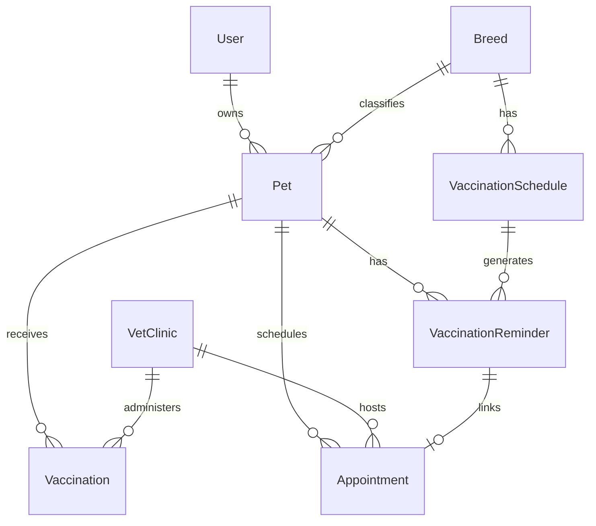

# Vaccination Reminder Engine - Developer Documentation

## Overview

The Vaccination Reminder Engine is an intelligent system for managing pet vaccination schedules, automated reminders, vet clinic appointments, and vaccination certificate generation. This documentation provides a comprehensive guide for developers integrating with and extending this feature.

## Architecture

```
backend/src/modules/
├── pets/                     # Pet and Breed management
│   ├── entities/
│   │   ├── pet.entity.ts
│   │   └── breed.entity.ts
│   ├── dto/
│   ├── pets.service.ts
│   ├── breeds.service.ts
│   └── pets.module.ts
├── vaccinations/             # Vaccination records and schedules
│   ├── entities/
│   │   ├── vaccination.entity.ts
│   │   └── vaccination-schedule.entity.ts
│   ├── dto/
│   ├── vaccinations.service.ts
│   ├── vaccination-schedules.service.ts
│   └── vaccinations.module.ts
├── reminders/                # Reminder engine with escalation
│   ├── entities/
│   │   └── vaccination-reminder.entity.ts
│   ├── dto/
│   ├── reminder.service.ts
│   ├── batch-processing.service.ts
│   └── reminders.module.ts
├── vet-clinics/              # Vet clinic and appointments
│   ├── entities/
│   │   ├── vet-clinic.entity.ts
│   │   └── appointment.entity.ts
│   ├── dto/
│   ├── vet-clinics.service.ts
│   ├── appointments.service.ts
│   └── vet-clinics.module.ts
└── certificates/             # Certificate generation
    ├── certificates.service.ts
    └── certificates.module.ts
```

---

## Database Schema

### Entity Relationships



### Key Entities

| Entity              | Table                   | Purpose                              |
| ------------------- | ----------------------- | ------------------------------------ |
| Pet                 | `pets`                  | Pet records with owner and breed     |
| Breed               | `breeds`                | Breed definitions with species       |
| Vaccination         | `vaccinations`          | Administered vaccination records     |
| VaccinationSchedule | `vaccination_schedules` | Breed-specific vaccination schedules |
| VaccinationReminder | `vaccination_reminders` | Pending/active reminders             |
| VetClinic           | `vet_clinics`           | Clinic information                   |
| Appointment         | `appointments`          | Scheduled appointments               |

---

## Core Features

### 1. Breed-Specific Vaccination Schedules

The system supports breed-specific and general vaccination schedules:

```typescript
// Create a breed-specific schedule
POST /api/v1/vaccination-schedules
{
  "breedId": "uuid",           // Optional - null for general schedules
  "vaccineName": "Rabies",
  "description": "Required by law",
  "recommendedAgeWeeks": 12,   // First dose at 12 weeks
  "intervalWeeks": 52,         // Annual booster
  "dosesRequired": 1,
  "isRequired": true,
  "priority": 10
}

// Seed default schedules
POST /api/v1/vaccination-schedules/seed/dogs
POST /api/v1/vaccination-schedules/seed/cats
```

### 2. Reminder Escalation System

Reminders automatically escalate through these stages:

| Stage   | Days Before Due | Status        |
| ------- | --------------- | ------------- |
| First   | 7 days          | `SENT_7_DAYS` |
| Second  | 3 days          | `SENT_3_DAYS` |
| Final   | Day of          | `SENT_DAY_OF` |
| Overdue | Past due        | `OVERDUE`     |

**Custom Intervals:**

```typescript
// Set custom reminder intervals for a specific reminder
PATCH /api/v1/reminders/:id/intervals
{
  "intervals": [14, 7, 1]  // 14 days, 7 days, 1 day before
}
```

### 3. Batch Processing

Process all pending reminders in one call:

```typescript
// Trigger batch processing
POST /api/v1/reminders/batch/process

// Response
{
  "processedCount": 150,
  "notificationsSent": 25,
  "errors": [],
  "notifications": [
    {
      "reminderId": "uuid",
      "petName": "Max",
      "vaccineName": "Rabies",
      "daysUntilDue": 3,
      "escalationLevel": "SECOND",
      "message": "Upcoming: Max's Rabies vaccination is due in 3 days."
    }
  ]
}
```

### 4. Vet Clinic Integration

Book appointments linked to reminders:

```typescript
POST /api/v1/appointments
{
  "petId": "uuid",
  "vetClinicId": "uuid",
  "reminderId": "uuid",        // Optional - links to reminder
  "scheduledDate": "2026-01-28T10:00:00Z",
  "type": "VACCINATION",
  "duration": 30
}
```

### 5. Certificate Generation

```typescript
// Get vaccination certificate
GET /api/v1/certificates/:vaccinationId

// Response
{
  "certificateCode": "VAX-A1B2C3D4E5F6",
  "issuedDate": "2026-01-21",
  "vaccination": {...},
  "pet": {...},
  "owner": {...},
  "vetClinic": {...},
  "isValid": true,
  "verificationUrl": "/api/v1/certificates/verify/VAX-A1B2C3D4E5F6"
}

// Verify certificate
GET /api/v1/certificates/verify/:code
```

---

## Integration Guide

### Step 1: Database Setup

Ensure PostgreSQL is running and the database exists:

```bash
# Using Docker
cd backend && docker-compose up -d

# Or create database manually
CREATE DATABASE petchain;
```

### Step 2: Run Migrations

With `DB_SYNCHRONIZE=true` in development, tables are created automatically. For production, use migrations.

### Step 3: Seed Default Schedules

```bash
# After starting the server
curl -X POST http://localhost:3000/api/v1/vaccination-schedules/seed/dogs
curl -X POST http://localhost:3000/api/v1/vaccination-schedules/seed/cats
```

### Step 4: Generate Reminders for Pets

```typescript
// Generate reminders for a single pet
POST /api/v1/reminders/generate/:petId

// Generate for all active pets
POST /api/v1/reminders/batch/generate
```

### Step 5: Set Up Scheduled Processing

Use a cron job or NestJS scheduler to run batch processing:

```typescript
// Recommended: Daily at 8 AM
POST / api / reminders / batch / process;
```

---

## API Reference

### Pets & Breeds

| Method | Endpoint                  | Description                      |
| ------ | ------------------------- | -------------------------------- |
| POST   | `/api/v1/pets`            | Create pet                       |
| GET    | `/api/v1/pets?ownerId=`   | Get pets (filtered by owner)     |
| GET    | `/api/v1/pets/:id`        | Get pet by ID                    |
| POST   | `/api/v1/breeds`          | Create breed                     |
| GET    | `/api/v1/breeds?species=` | Get breeds (filtered by species) |

### Vaccinations

| Method | Endpoint                                | Description        |
| ------ | --------------------------------------- | ------------------ |
| POST   | `/api/v1/vaccinations`                  | Record vaccination |
| GET    | `/api/v1/vaccinations/pet/:petId`       | Get pet's history  |
| GET    | `/api/v1/vaccinations/pet/:petId/stats` | Get statistics     |

### Reminders

| Method | Endpoint                             | Description             |
| ------ | ------------------------------------ | ----------------------- |
| GET    | `/api/v1/reminders?ownerId=`         | Get user's reminders    |
| GET    | `/api/v1/reminders/upcoming?days=30` | Get upcoming reminders  |
| GET    | `/api/v1/reminders/stats`            | Get reminder statistics |
| POST   | `/api/v1/reminders/:id/complete`     | Mark complete           |
| POST   | `/api/v1/reminders/:id/snooze`       | Snooze reminder         |
| POST   | `/api/v1/reminders/batch/process`    | Process all             |

### Vet Clinics & Appointments

| Method | Endpoint                           | Description      |
| ------ | ---------------------------------- | ---------------- |
| POST   | `/api/v1/vet-clinics`              | Create clinic    |
| GET    | `/api/v1/vet-clinics?city=`        | Search clinics   |
| POST   | `/api/v1/appointments`             | Book appointment |
| POST   | `/api/v1/appointments/:id/confirm` | Confirm          |
| POST   | `/api/v1/appointments/:id/cancel`  | Cancel           |

---

## Extending the System

### Adding Notification Providers

The `ReminderService.processReminderEscalation()` returns `ReminderNotification[]` objects. Integrate with your notification service:

```typescript
// Example: Email integration
const notifications = await reminderService.processReminderEscalation();

for (const notification of notifications) {
  await emailService.send({
    to: notification.ownerEmail,
    subject: `Vaccination Reminder for ${notification.petName}`,
    body: notification.message,
  });
}
```

### Adding New Vaccine Types

Add new schedules via API or extend the seed methods in `VaccinationSchedulesService`.

### Custom Certificate Templates

Extend `CertificatesService` to generate PDFs using libraries like `pdfkit` or `puppeteer`.

---

## Environment Variables

No new environment variables are required. The system uses the existing database configuration.

---

## Running Tests

```bash
cd backend
bun run test
```

---

## Troubleshooting

| Issue                         | Solution                                  |
| ----------------------------- | ----------------------------------------- |
| Foreign key constraint errors | Ensure breeds exist before creating pets  |
| Reminders not generating      | Check if pet has breed assigned           |
| Certificate not found         | Ensure vaccination has a certificate code |
